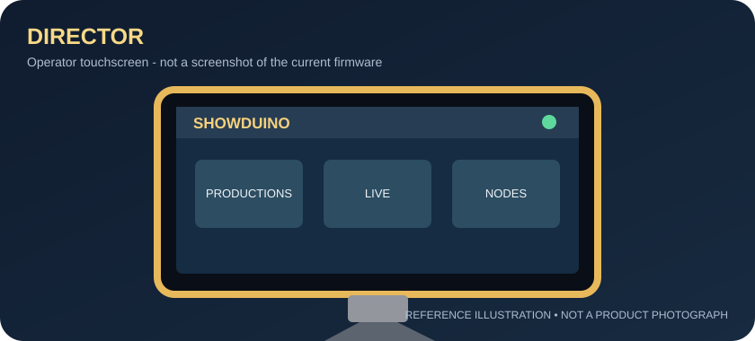
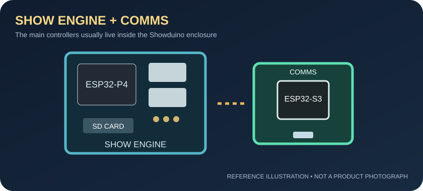
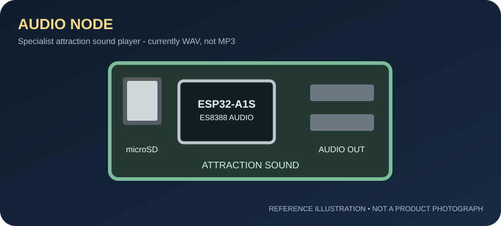
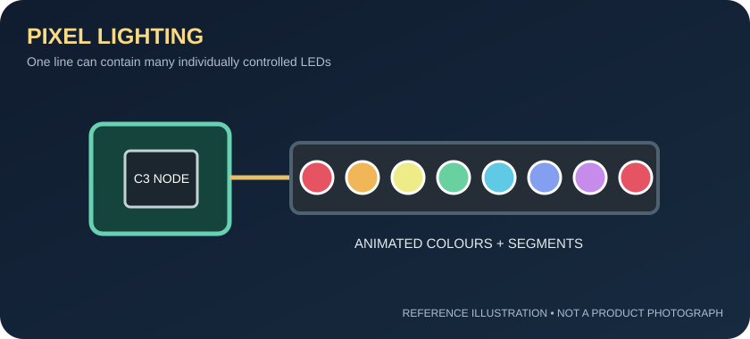
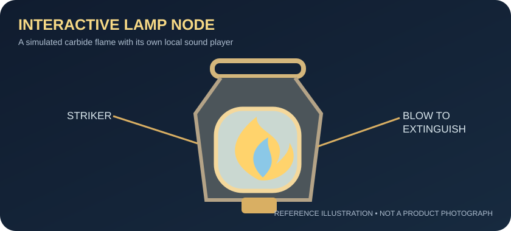
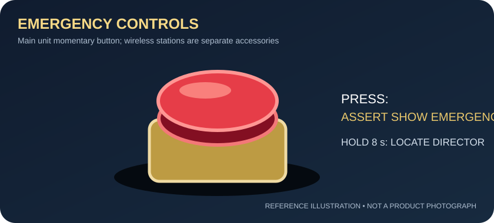

# Showduino | The Operator's Guide

**The Director touchscreen, sound, lighting and everyday attraction operation**  
**Audience:** first-time owners, attraction operators and non-technical staff  
**Product baseline:** Showduino 1.0.0-rc.1 · **Guide revision:** 0.1 / 21 September 2026  
**Source reviewed:** [Showduino repository](../../README.md), current active Director firmware, specialist-node documents and RC physical-test checklist.

> **This is the easy-to-use companion to the complete [Showduino User Manual](SHOWDUINO_USER_MANUAL.md).** It explains what to touch and what to expect, not how to write ESP32 firmware. The product is still a release candidate; functions noted as awaiting physical acceptance are not promises of a fully commissioned public-venue installation.

**About the pictures:** The labelled drawings in this guide explain the *type and role* of each component. They are **reference illustrations**, not photos of Toby's finished enclosure, an exact board revision or screenshots of the current Director UI. A final commercial print edition should replace them with photos of the actual supplied unit and screenshots captured from the accepted firmware.

---

## 1. Meet Showduino

Showduino is an attraction-control system. It can run timed sequences of **sound**, **coloured lights** and supported **interactive effects** while showing the operator what is happening.

**Your everyday job is simple:**

1. Turn on the system and check that it is ready.
2. Choose the attraction's show on the **Director**.
3. Press **LOAD**, then **RUN/START** when the area is ready.
4. Keep an eye on **LIVE** and **NODES** while guests are inside.
5. Use **STOP** when the attraction needs a normal stop, or the physical emergency button when there is an emergency.

You do **not** need to understand circuit boards, IP addresses or code to run an already prepared production. An installer or show designer prepares the sound files, lighting, wiring and show timeline before you operate it.

**The four main parts, in ordinary language:**

| Part | What it means to the operator |
| --- | --- |
| **Director** | Your touchscreen control desk. You choose and monitor shows here. |
| **Show Engine** | The computer inside Showduino that actually runs the show and owns emergency state. |
| **Communications Controller** | The connection between your screen, browser, nodes and Show Engine. |
| **Nodes** | Smaller boxes that make an individual sound, light or interactive prop work. |

**Remember:** tapping a button sends a *request*. The action is confirmed when the Director reports the Show Engine's new state. A show that is already loaded on the Show Engine is designed to carry on without an open browser or an active Director connection, although individual wireless effects can still be affected by a node or link fault.

---

## 2. The Director: your main control screen

The Director is a **5-inch, 800 x 480 touch display**. It may be mounted on a tilting support on the Showduino assembly. Your supplied unit's appearance and final connector labels depend on its hardware revision.

The active Director interface has these main areas. **The labels below come from the current firmware; their precise arrangement may change before final release.**

| Screen | What you use it for |
| --- | --- |
| **HOME** | Your starting point: an overview of system, show and connection status. |
| **PRODUCTIONS** | Find a saved show, select it, and use **LOAD**, **RUN** or **DETAILS** as appropriate. |
| **SHOW DETAILS** | Check the selected show's information before running it. |
| **LIVE** | Follow the running show and request start, pause, resume or stop as allowed by its current state. |
| **NODES** | See the connected specialist devices and open their status/settings panels. |
| **AUDIO NODE** | Select and test suitable sound files, control volume and view audio status when permitted. |
| **DIAGNOSTICS** | Check the health of connections, storage, system audio, pixels and nodes. |
| **SETTINGS** | Configure Director display behaviour and view relevant settings. |
| **AUDIO** | Director-facing **system-audio** information. It is not the attraction Audio Node library. |
| **SYSTEM LOGS** | See recent system messages when something does not behave as expected. |

**On-screen status words:** **ONLINE/READY** usually indicate a recognised, available device; **OFFLINE**, **FAULT**, **NO STORAGE**, **SEARCHING** or **SYNCHRONISING** mean the relevant device is not yet ready for that task. Confirm the *required* device is available rather than assuming that a lit touchscreen means the whole system is ready.

### A normal start, step by step

1. Check that the Showduino enclosure, Director, cables, speakers and any connected effect equipment are intact. Keep the attraction closed while commissioning.
2. Switch on according to your supplied installation instructions. For the current RC bench arrangement the test order is **Show Engine -> Comms -> Director -> Nodes**.
3. On **HOME**, wait for the system to report a usable Show Engine link and no unresolved emergency or fault.
4. Open **NODES** and confirm that the devices required by *this* production are online. An attraction with no Lamp Node does not need one to appear.
5. Open **PRODUCTIONS**. Tap the intended production and choose **LOAD**. Confirm that the correct production is loaded; simply highlighting a row is not the same as loading it.
6. When the attraction is physically ready, use **RUN** on Productions or the available **START** action from LIVE. Check that the state changes to **RUNNING** before admitting guests.
7. During the show, use **LIVE** to check progress. Use **PAUSE/RESUME** only where your operating procedure permits. Use **STOP** for a normal controlled stop.

**Important:** uploading a show to storage, loading it into the Show Engine and starting it are *three different actions*. A newly uploaded show does not start by itself.

### When the screen goes dark

The Director's configured automatic display-off behaviour turns off its **backlight**, not the whole controller. Touch/activity normally wakes the display. If touches are inaccurate, the active firmware provides **Settings -> Display -> CALIBRATE**, a five-target alignment procedure saved on the Director; this still requires physical acceptance before final customer sign-off.

---

## 3. Sounds: what actually plays the audio?

**There are three different sound paths. They are not interchangeable.**

| Device | Sound purpose | Supported customer-facing format in this RC |
| --- | --- | --- |
| **Audio Node** | Music, atmosphere, voices and jump-scare effects *for the attraction* | **16-bit PCM WAV** from its **own microSD card**. MP3/Ogg/FLAC decoding is **not** implemented in the current Audio Node firmware. |
| **Show Engine's internal audio** | Showduino's own startup, notification and emergency/system sounds | Suitable **PCM WAV** system assets, not the attraction soundtrack. |
| **Interactive Lamp Node** | Its own strike, ignition, flame-loop and emergency sounds | Four designated **MP3** files on its local **Fermion DFPlayer Pro** module. This is *not* the general-purpose attraction Audio Node. |

### Playing a sound with the Director

For an Audio Node that has been installed and commissioned:

1. Open **NODES -> AUDIO NODE / AUDIO DESK**, or the dedicated **AUDIO NODE** page.
2. Confirm the node is **ONLINE** and has storage available. A node marked **NO STORAGE** cannot play files from its card.
3. Choose **SELECT ASSET** to browse the files reported by that Audio Node. Select the required file.
4. Use **TEST** for a commissioning check, or **PLAY** for ordinary playback when controls are enabled. **LOOP** repeats, **PAUSE/RESUME** changes playback state, **STOP** ends it, and **VOL - / VOL +** adjusts the level.
5. Listen through the **speaker, headphone or line output connected to the Audio Node**, not through the Director touchscreen.

The Director can display an Audio Node's input-level/noise-floor/trigger diagnostics. This does **not** mean a microphone automatically starts a scare: mapping a sound event to a show action is a separate authoring/engine feature.

**Why are PLAY and LOOP greyed out?** The Director firmware can lock manual play/loop requests while the show is running or the Node is under show control. Do not attempt to bypass that lock from the Node's own webpage; the Show Engine owns live production playback.

### Putting your own sound onto Showduino

Ask the installer/show designer to place an approved file on the **Audio Node's microSD card**. The firmware expects files beneath:

\`\`\`text
/showduino/audio/
    ambience/
    effects/
    dialogue/
    music/
    stingers/
    test/
\`\`\`

For example, a supported 16-bit PCM file stored at \`/showduino/audio/effects/thunder.wav\` is referenced as \`effects/thunder.wav\` by the Audio Node. It must be a genuine WAV file: **renaming \`thunder.mp3\` to \`thunder.wav\` does not convert it**. Export/convert the audio to 16-bit PCM WAV, typically at 44.1 or 48 kHz; the current Audio Node also supports other documented sample rates. A show file must reference the same relative file name that is present on the card.

**No sound?** Check **NODES -> AUDIO NODE**, the node's storage status, the chosen asset, volume, amplifier/speaker connection and the current emergency state. The main Showduino system speaker is not an automatic backup for missing attraction audio.

### And what about MP3 on the Lamp?

The Lamp Node is a specialised prop. Its local MP3 library uses **\`flick.mp3\`**, **\`fire_ignite.mp3\`**, **\`flameloop.mp3\`** and **\`emergency.mp3\`** on the Fermion module. Those names are tied to the lamp's actions; loading a random MP3 onto the Show Engine will **not** make it appear in the Audio Node library.

See the [Audio Node guide](../../docs/audio-node.md) and [Lamp Node guide](../../docs/s3-lamp-node.md) for format limits and technical setup.

---

## 4. Lighting: colours, effects and pixels

A **pixel** is one individually controllable light on a compatible addressable LED strip. Unlike an ordinary lamp that only switches on or off, a pixel line can make different parts of a prop show different colours and animations at the same time.

Examples include fire flicker inside a lantern, lightning in a haunted corridor, a colour-chasing time machine or a slow red warning pulse. A **segment** is simply a named/selected section of one strip; it can have its own effect while another section displays something else.

### Which lighting device do I use?

- **Main Show Pixel Line:** pixels connected to the Show Engine's **GPIO23** output. The current local engine supports up to **1,024 configured pixels** and 16 segment slots.
- **Pixel Node:** a small separate ESP32-C3 controller for a remote pixel strip. Its current configured limit is **1–512 pixels** per node.
- **Emergency/signage pixels:** the Show Engine's separate **GPIO24** output. These are reserved for Showduino's defined emergency/signage behaviour, **not** for ordinary production lighting.
- **Lamp Node Jewel:** a seven-pixel light inside the simulated carbide lamp; its behaviour is controlled by the lamp.

### What does the Director do with lighting?

Use **NODES** to see whether a remote Pixel Node has joined and to open available node information. **DIAGNOSTICS -> PIXELS** displays available pixel health/status. A Pixel Node needs a valid configured length and its line initialised before it can light correctly.

The Director is **not intended to be a full timeline/lighting editor**. A show designer prepares lighting looks and cue timings through the Showduino browser commissioning/Studio tools, then the operator **loads and runs the prepared show** on the Director. The browser **Outputs** page is the more detailed local pixel-commissioning surface. The Studio authoring workflow is evolving and not every visual action is guaranteed to compile and run on the current RC hardware.

**If lights unexpectedly go bright white:** check **EMERGENCY** before calling it a lighting fault. The Showduino emergency override is designed to make the entire configured show-pixel line and remote pixel lines white. Effects do not automatically restart when Emergency is cleared.

**Do not** connect a long/high-current strip directly to the tiny controller's power pin. Pixel lighting needs appropriately rated external power and an installation designed for its full-white emergency current.

---

## 5. Interactive props, inputs and other nodes

**Interactive Lamp Node:** the simulated carbide lamp has a physical striker button, animated flame LEDs, microphone-based blow detection and its own local MP3 sound effects. In standalone mode it can ignite and be blown out without the main Showduino show; when Showduino owns it, new show commands are authoritative. The Director **NODES -> LAMP NODE** panel exposes its state and available actions, including **IGNITE**, **EXTINGUISH**, **FLARE** and **REFRESH** as permitted by the current state.

**Sensors and switches:** an installer can connect supported inputs so the Show Engine receives trigger signals. What a specific door switch or motion detector *does* depends on the prepared show and the supported cue/runtime path; seeing a sensor in the system does not mean every possible reaction is already configured.

**MOSFET Node:** the Director may show a MOSFET tile, but the repository still classifies its specialist firmware as **planned**, not a completed, commissioned output product. Do not promise customers that mains or motor equipment can be connected directly to this tile.

**DMX:** the Director may also contain a DMX tile. Professional DMX/E1.31 production-lighting control remains **parked**; a visible tile is not evidence that a DMX expansion has been supplied.

### A short example: a chamber show

The show designer prepares a sequence in which a compatible trigger starts audio from the **Audio Node**, the **Pixel Node** changes colour and the **Lamp Node** performs a flame action. An operator does not program those individual commands on the Director during a live show: they select the already tested **production**, press **RUN**, watch **LIVE**, and respond if a required node reports a fault.

This is an *illustrative capability combination*, not proof that any particular mixed-device show has passed physical acceptance on your installation.

---

## 6. Emergency and Locate: know the difference

**Your Showduino main-unit emergency button is a *momentary* pushbutton.** A valid press asserts and latches the software Emergency state after input debounce. **Releasing the button does not clear it.** A continuously held press lasting **eight seconds** additionally requests **Locate** on the Director.

The normal emergency response stops/pauses theatrical operation as defined by the Show Engine, interrupts attraction audio and overrides pixel-capable lighting. **Showduino is not a certified fire alarm, evacuation-lighting or machinery safety controller** and must not replace the venue's independently required safety arrangements.

### Clearing Showduino Emergency

Only after the real-world incident has been resolved and the area is safe:

1. Release the main physical button, if it is still pressed.
2. On the **Director EMERGENCY** screen, choose **CLEAR EMERGENCY**.
3. Read the confirmation and choose **CONFIRM CLEAR**.
4. Check that the Show Engine accepts the clear. A held button or a new assertion can prevent clearance.
5. Treat the show as interrupted. **Clearing Emergency does not restart it.** Follow the attraction's approved recovery/restart procedure.

**To find a sleeping or misplaced Director:** hold the same main button for eight seconds. Emergency asserts on the initial press; Locate then forces the Director screen on and flashes its ambient lights. The **first touch acknowledges Locate only**. It does **not** clear Emergency.

**Wireless Emergency Nodes** are separate accessories with their own input/latch design. They can **assert** but cannot **clear** the central Emergency. Do not assume their buttons use the main-unit's eight-second Locate gesture. The full emergency and clear procedure still needs physical sign-off on the actual installed hardware.

---

## 7. A phone or computer: useful, but not the Director

You can also use the **local browser console** for more detailed configuration, checking nodes, commissioning lighting and managing shows. On the current RC bench configuration, connect to the supplied **Showduino** Wi-Fi access point, then open:

\`\`\`text
http://192.168.4.1/          local system console
http://192.168.4.1/studio/   embedded Studio authoring snapshot
\`\`\`

Your installer must confirm the actual network name, address and credentials used by your finished unit. The documented default password is a **bench credential, not a public venue password**.

**Studio is where shows are prepared; Director is where operators run them.** The SHDO v2 authoring format, RAM timeline commissioning and persistent SD deploy path have different supported subsets. A show file being editable/exportable does not guarantee every effect in it is executable on the current firmware. Deployment, **LOAD** and **START** are separate stages.

The local Show Engine does not need venue Internet to run an already loaded show. Internet access is relevant to optional functions such as checking for a Comms firmware update; **system-wide OTA is not currently available**.

---

## 8. Quick troubleshooting

| What you see | What to check first |
| --- | --- |
| **CONNECTION LOST** | Is Comms linked to the Show Engine? Is the Director linked to Comms? Do not confuse an Internet failure with a Show Engine failure. |
| **NO SD CARD / missing production** | Check the required Show Engine SD storage and its status. Do not remove a card during an active operation. |
| **Audio Node OFFLINE / NO STORAGE** | Check Audio Node power/link, its **own** microSD, asset name, speaker and volume. |
| **CONTROLLED BY SHOWDUINO** on a node | This can be normal: the Show Engine owns its theatrical controls. Use approved Showduino controls rather than bypassing ownership. |
| **Pixel line stays dark** | Check node link, stored pixel count, line initialisation, power supply and whether Emergency was recently cleared. |
| **Every configured pixel is white** | Treat as an Emergency indication first; check the Director before changing lighting settings. |
| **Show will not start** | Check a production is loaded, Emergency is clear, the Show Engine is ready and required nodes are present. |
| **Emergency cannot be cleared** | Check the incident is resolved, the physical button is released and the Director clear confirmation is accepted. Never bypass a fault to force a start. |

If the cause is not clear, open **DIAGNOSTICS** and **SYSTEM LOGS**, record the exact error and contact the person who installed/commissioned the system. Do not flash firmware, alter wiring or change safety policy during a public session.

---

## 9. The operator's one-minute pre-opening check

- [ ] Physical attraction, wiring, speakers and lighting are safe and undamaged.
- [ ] Independent venue fire/evacuation/machinery safety arrangements are available as required.
- [ ] Director, Comms and Show Engine show a healthy usable link; no unexplained fault is present.
- [ ] Main Emergency input and clearance have passed the venue's approved daily check.
- [ ] The correct production is **loaded**.
- [ ] Every **required** Audio, Lamp, Pixel or other installed node is healthy and has its necessary assets.
- [ ] A controlled test cycle has verified the intended sound, lighting and effect behavior.
- [ ] The operator knows how to issue a normal **STOP** and how to respond to a real emergency.

For a public installation use the full [Pre-Opening Checklist](SHOWDUINO_PRE_OPENING_CHECKLIST.md), not this one-minute reminder alone.

---

## More help and accuracy notes

- [Full Showduino User Manual](SHOWDUINO_USER_MANUAL.md)
- [Director and system quick start](SHOWDUINO_QUICK_START.md)
- [Audio Node - supported formats and controls](../../docs/audio-node.md)
- [Interactive S3 Lamp Node](../../docs/s3-lamp-node.md)
- [C3 Pixel Node](../../docs/c3-pixel-node.md)
- [Studio capabilities and limitations](../../docs/studio/README.md)
- [Production storage and deployment](../../docs/production-storage.md)
- [Physical acceptance checks](../../docs/physical-test-checklist.md)
- [Manual verification gaps](SHOWDUINO_MANUAL_GAPS.md)

**Editorial status:** This guide was written from the active repository and its documented RC boundaries. It is not a record of physical tests performed in this documentation session. Before printing a final customer edition, replace the reference illustrations with approved product photographs, capture Director screenshots from the *actual accepted firmware build*, record the supplied firmware versions and confirm the installer-facing network, audio and lighting setup for the shipped hardware.
